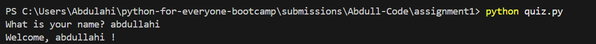
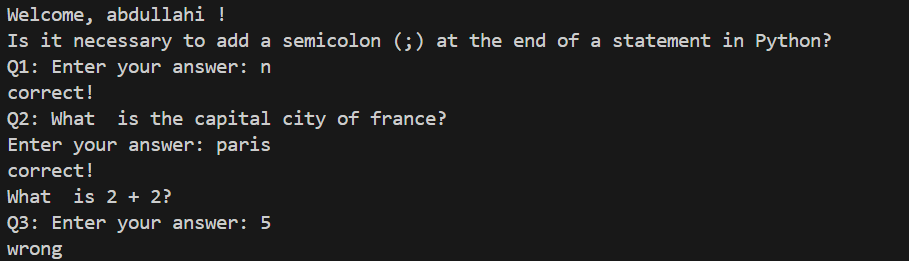

## 1-Greeting

* code
```python  
name = input('What is your name? ')
print('Welcome, ', name, '!')

```

* output
  



## 2-Questions

```python
# quest-1

score = 0

total_questions = 3

print('Is it necessary to add a semicolon (;) at the end of a statement in Python? ')
# expected answer no, or n or N or NO
answer = input('Q1: Enter your answer: ')
if answer == 'N' or answer == 'n' or answer == 'no' or answer == 'NO':
    score += 1
    print('correct!')
else:
    print('wrong')

# quest-2
print('Q2: What  is the capital city of france? ')
# expected answer paris or Paris
answer2 = input('Enter your answer: ')
if answer2 == 'paris' or answer2 == 'Paris':
    score += 1
    print('correct!')
else:
    print('wrong')

# quest-3
print('What  is 2 + 2? ')
# expected answer 4
answer3 = int(input('Q3: Enter your answer: '))
if answer3 == 4:
    score += 1
    print('correct!')
else:
    print('wrong')
```

* output
  



  ## 3- final message : score and name

  
  


